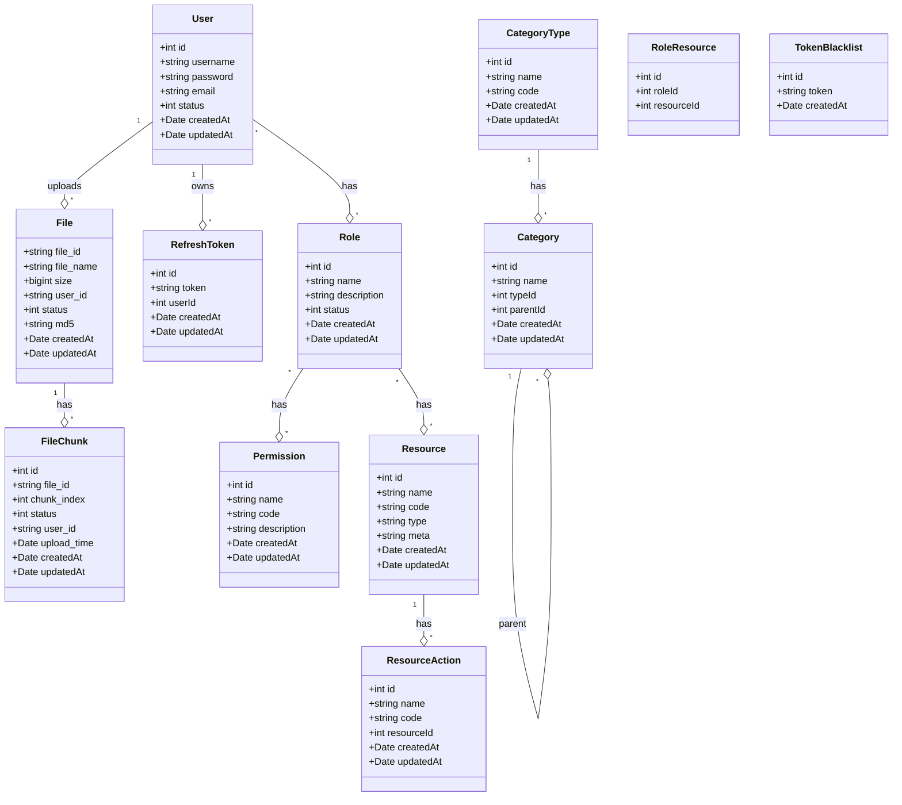

# 系统主要数据模型类图与关系图

```mermaid
classDiagram
    class File {
        +string file_id
        +string file_name
        +bigint size
        +string user_id
        +int status
        +string md5
        +Date createdAt
        +Date updatedAt
    }
    class FileChunk {
        +int id
        +string file_id
        +int chunk_index
        +int status
        +string user_id
        +Date upload_time
        +Date createdAt
        +Date updatedAt
    }
    class User {
        +int id
        +string username
        +string password
        +string email
        +int status
        +Date createdAt
        +Date updatedAt
    }
    class Role {
        +int id
        +string name
        +string description
        +int status
        +Date createdAt
        +Date updatedAt
    }
    class Permission {
        +int id
        +string name
        +string code
        +string description
        +Date createdAt
        +Date updatedAt
    }
    class Resource {
        +int id
        +string name
        +string code
        +string type
        +string meta
        +Date createdAt
        +Date updatedAt
    }
    class ResourceAction {
        +int id
        +string name
        +string code
        +int resourceId
        +Date createdAt
        +Date updatedAt
    }
    class CategoryType {
        +int id
        +string name
        +string code
        +Date createdAt
        +Date updatedAt
    }
    class Category {
        +int id
        +string name
        +int typeId
        +int parentId
        +Date createdAt
        +Date updatedAt
    }
    class RoleResource {
        +int id
        +int roleId
        +int resourceId
    }
    class RefreshToken {
        +int id
        +string token
        +int userId
        +Date createdAt
        +Date updatedAt
    }
    class TokenBlacklist {
        +int id
        +string token
        +Date createdAt
    }

    File "1" --o "*" FileChunk : has
    User "1" --o "*" File : uploads
    User "1" --o "*" RefreshToken : owns
    User "*" --o "*" Role : has
    Role "*" --o "*" Permission : has
    Role "*" --o "*" Resource : has
    Resource "1" --o "*" ResourceAction : has
    CategoryType "1" --o "*" Category : has
    Category "1" --o "*" Category : parent
```

> 说明：
>
> - 关联关系基于常见 RBAC 和业务模型，部分多对多通过中间表（如 RoleResource）实现。
> - 可根据实际 models 目录下的定义进一步细化字段和关系。
