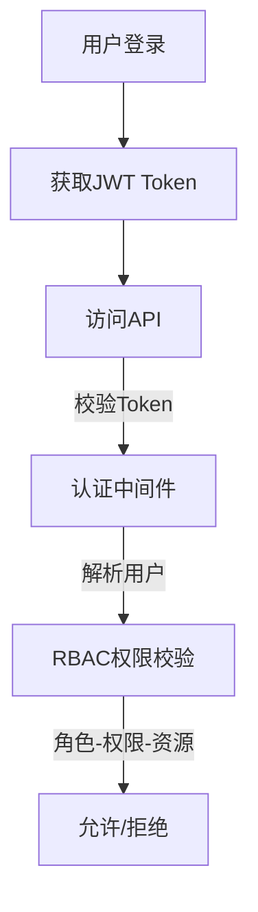

# RBAC 权限流程说明（细化版）

## 1. 核心概念

- **用户（User）**：系统登录主体，可分配多个角色。
- **角色（Role）**：权限集合，定义一类用户的操作范围。
- **权限（Permission）**：对资源的操作能力（如 `system:user:add`、`system:user:edit`）。
- **资源（Resource）**：菜单、页面、功能点等，支持多级结构。
- **资源操作（ResourceAction）**：按钮级操作（如新增、编辑、删除），每个操作自动生成一个权限点。

## 2. 认证与鉴权流程



- 用户登录（/api/auth/login）返回 accessToken 和 refreshToken：
  ```json
  {
    "code": 200,
    "message": "ok",
    "data": {
      "accessToken": "...",
      "refreshToken": "..."
    }
  }
  ```
- 前端持有 accessToken 后，再调用用户信息接口（如 /api/users/me）获取：
  - 用户基本信息（id, username, email, ...）
  - roles：所有可用角色清单（如 ["admin", "manager", "user"]）
  - routes：当前用户可见的菜单资源（Resource）树，适配前端路由
  - permissions：当前用户拥有的按钮级权限清单（如 ["system:user:add", "system:user:edit", "system:user:delete"]）

## 3. 角色-权限-资源分配关系

- 一个用户可分配多个角色（user_roles 表）。
- 一个角色可拥有多个权限（role_permissions 表）、可见多个资源（role_resources 表）。
- 权限与资源操作一一对应，支持按钮级控制。
- 资源支持多级结构，菜单、页面、按钮均为资源。

## 4. 前端路由与按钮权限控制建议

- 路由菜单渲染：根据用户信息接口返回的 routes（Resource），动态生成侧边栏/菜单。
- 按钮权限渲染：根据 permissions 决定按钮是否显示/可用。
- 建议接口：
  - `/api/auth/login` 登录获取 Token
  - `/api/users/me` 获取当前用户信息、roles、routes、permissions

## 5. RBAC 流程伪图

```text
[用户] --登录--> [Token] --请求--> [后端认证] --RBAC校验--> [资源/接口/按钮]
```

## 6. 权限验证机制

- 系统使用中间件进行权限验证，位于 `middlewares/auth.js`。
- 权限验证基于 JWT 令牌中的用户 ID，从数据库查询用户的角色及权限。
- 权限格式必须严格匹配，如 `system:user:add`。
- 管理员角色拥有所有系统权限。

### 权限中间件伪代码

```js
// middlewares/auth.js
module.exports = async function (req, res, next) {
  const token = req.headers["authorization"];
  const user = await verifyToken(token);
  const permissions = await getUserPermissions(user.id);
  if (!permissions.includes(req.requiredPermission)) {
    return res.json({ code: 403, message: "无权限", data: {} });
  }
  next();
};
```

## 7. 权限命名与资源编码规范

- 权限命名：`system:user:add`、`system:user:edit`、`category:category:view` 等
- 资源编码：`system:user`、`system:role`、`category:type` 等
- 资源操作：`add`、`edit`、`delete`、`view` 等

## 8. 典型接口返回结构

```json
{
  "code": 200,
  "message": "ok",
  "data": {
    "user": { "id": 1, "username": "admin", ... },
    "roles": ["admin", "manager", "user"],
    "routes": [ ... 菜单资源树 ... ],
    "permissions": ["system:user:add", "system:user:edit", ...]
  }
}
```

---

如需更详细的接口/数据结构说明，请参考 docs 目录下相关文档。
