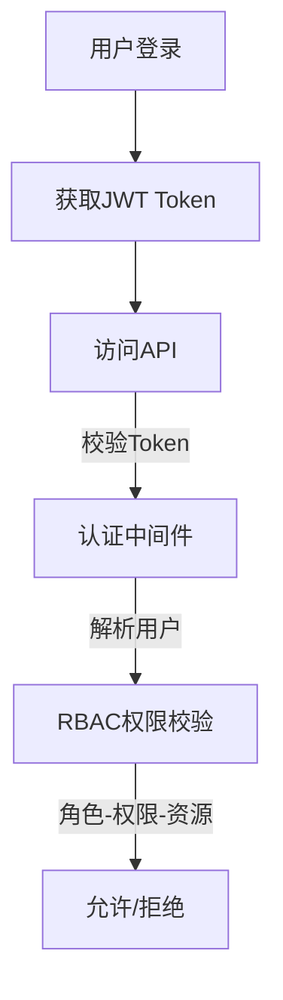

# RBAC 权限流程说明

## 1. 核心概念

- **用户（User）**：系统登录主体，可分配多个角色。
- **角色（Role）**：权限集合，定义一类用户的操作范围。
- **权限（Permission）**：对资源的操作能力（如 create_user、view_users）。
- **资源（Resource）**：菜单、页面、功能点等，支持多级结构。
- **资源操作（ResourceAction）**：按钮级操作（如新增、编辑、删除）。

## 2. 认证与鉴权流程



- 用户登录（/api/auth/login）只返回 accessToken：
  ```json
  { "accessToken": "..." }
  ```
- 前端持有 accessToken 后，再调用用户信息接口（如 /api/users/me）获取：
  - 用户基本信息（id, username, email, ...）
  - roles：所有可用角色清单（如 ["admin", "manager", "user"]）
  - routes：当前用户可见的菜单资源（Resource）树，适配前端路由
  - permissions：当前用户拥有的按钮级权限清单（如 ["add", "edit", "delete"]）

## 3. 角色-权限-资源分配关系

- 一个用户可分配多个角色。
- 一个角色可拥有多个权限、可见多个资源。
- 权限与资源、资源操作可灵活配置，支持按钮级控制。

## 4. 前端路由与按钮权限控制建议

- 路由菜单渲染：根据用户信息接口返回的 routes（Resource），动态生成侧边栏/菜单。
- 按钮权限渲染：根据 permissions 决定按钮是否显示/可用。
- 建议接口：
  - `/api/auth/login` 登录获取 Token
  - `/api/users/me` 获取当前用户信息、roles、routes、permissions

## 5. RBAC 流程伪图

```text
[用户] --登录--> [Token] --请求--> [后端认证] --RBAC校验--> [资源/接口/按钮]
```

## 6. 前端开发接口交互建议

- 登录后保存 Token，所有请求带上 Authorization 头。
- 获取用户信息时一并返回角色清单、菜单资源、按钮权限。
- 路由和按钮渲染均基于后端返回的权限数据，前端无需硬编码权限点。
- 建议后端返回如下结构：

```json
{
  "user": { "id": 1, "username": "admin", ... },
  "roles": ["admin", "manager", "user"],
  "routes": [ ... 菜单资源树 ... ],
  "permissions": ["add", "edit", "delete", ...]
}
```

---

如需更详细的接口/数据结构说明，请参考 docs 目录下相关文档。
