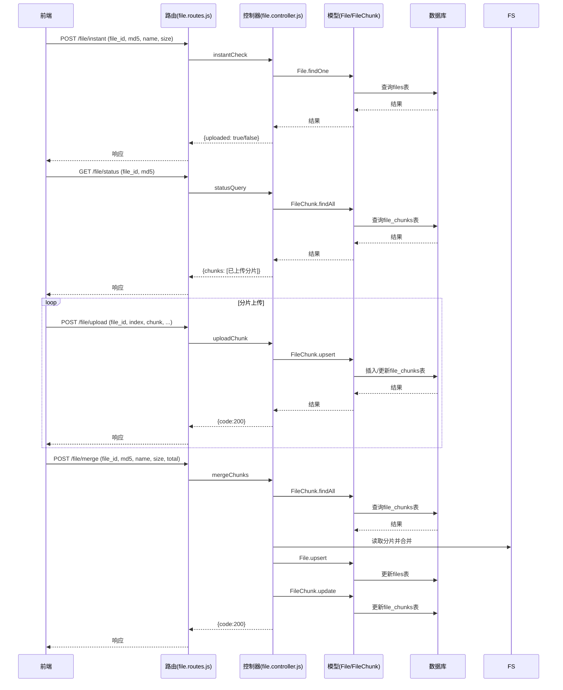
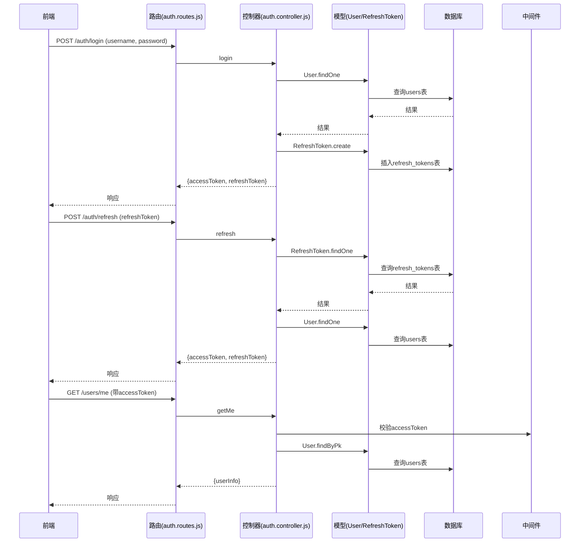
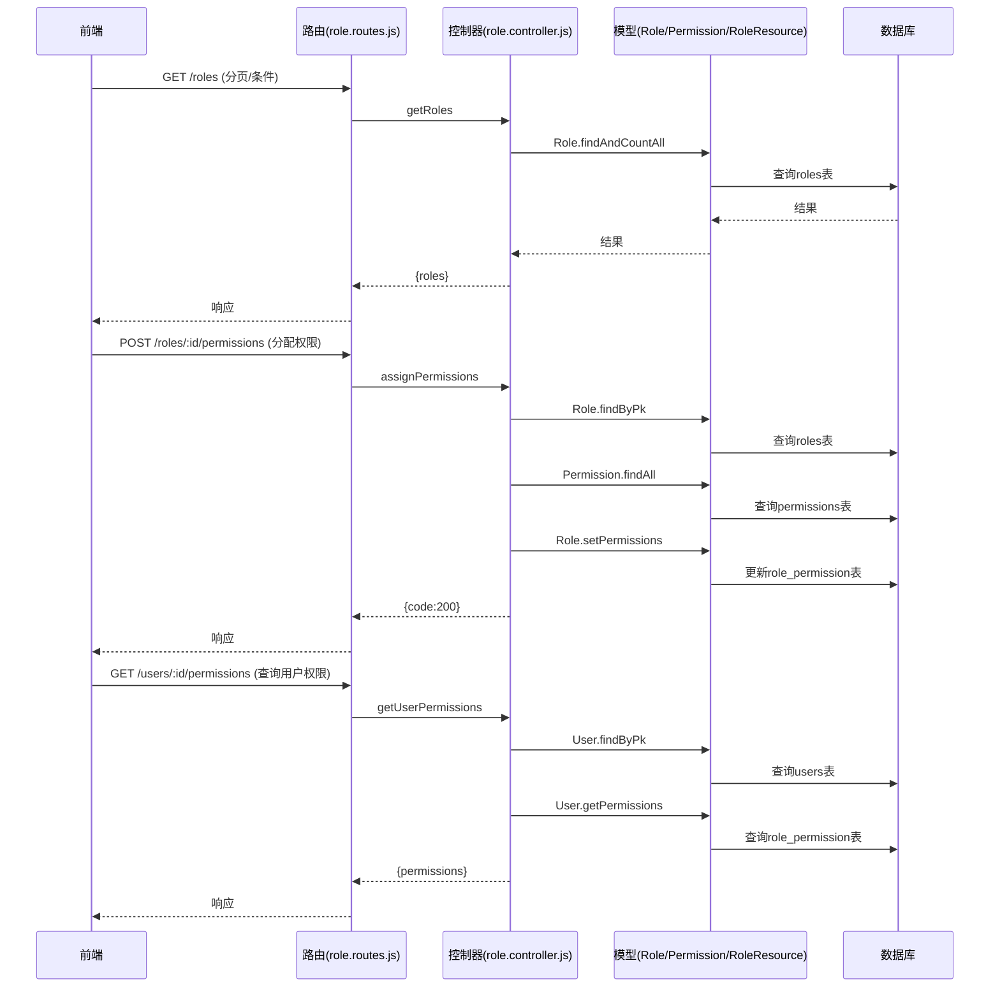
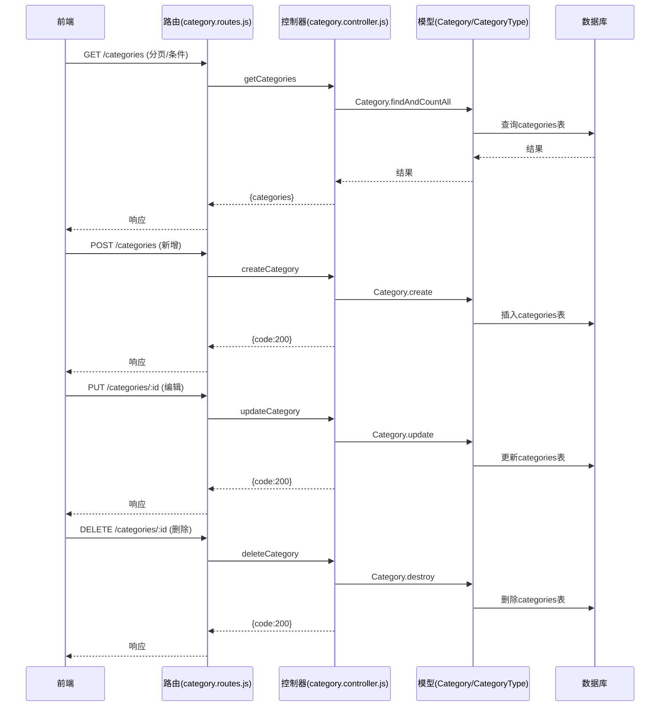
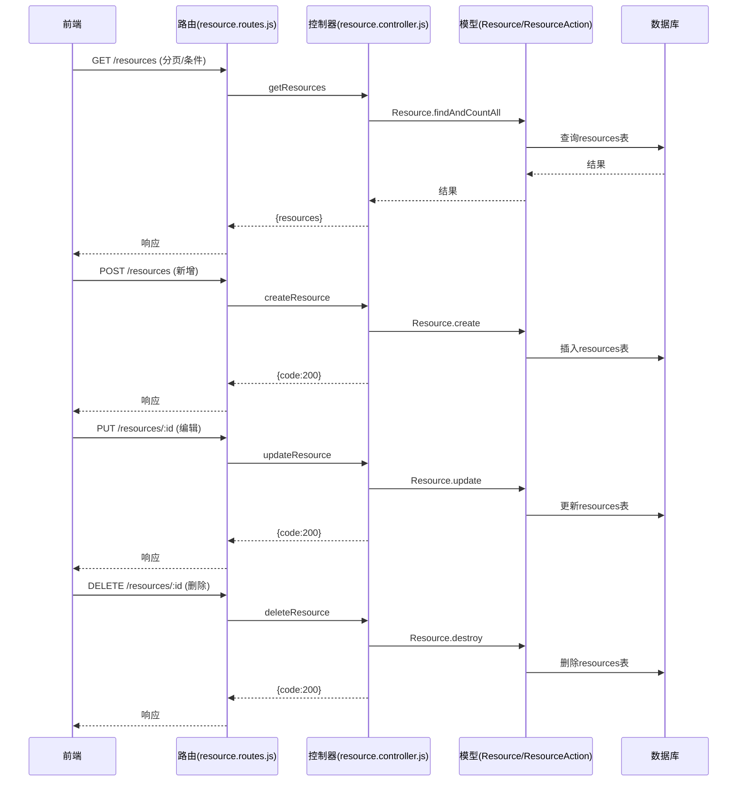

# 系统主要功能模块时序图

## 1. 文件分片秒传

```mermaid
sequenceDiagram
    participant FE as 前端
    participant Route as 路由(file.routes.js)
    participant Ctrl as 控制器(file.controller.js)
    participant Model as 模型(File/FileChunk)
    participant DB as 数据库

    FE->>Route: POST /file/instant (file_id, md5, name, size)
    Route->>Ctrl: instantCheck
    Ctrl->>Model: File.findOne
    Model->>DB: 查询files表
    DB-->>Model: 结果
    Model-->>Ctrl: 结果
    Ctrl-->>Route: {uploaded: true/false}
    Route-->>FE: 响应

    FE->>Route: GET /file/status (file_id, md5)
    Route->>Ctrl: statusQuery
    Ctrl->>Model: FileChunk.findAll
    Model->>DB: 查询file_chunks表
    DB-->>Model: 结果
    Model-->>Ctrl: 结果
    Ctrl-->>Route: {chunks: [已上传分片]}
    Route-->>FE: 响应

    loop 分片上传
        FE->>Route: POST /file/upload (file_id, index, chunk, ...)
        Route->>Ctrl: uploadChunk
        Ctrl->>Model: FileChunk.upsert
        Model->>DB: 插入/更新file_chunks表
        DB-->>Model: 结果
        Model-->>Ctrl: 结果
        Ctrl-->>Route: {code:200}
        Route-->>FE: 响应
    end

    FE->>Route: POST /file/merge (file_id, md5, name, size, total)
    Route->>Ctrl: mergeChunks
    Ctrl->>Model: FileChunk.findAll
    Model->>DB: 查询file_chunks表
    DB-->>Model: 结果
    Ctrl->>FS: 读取分片并合并
    Ctrl->>Model: File.upsert
    Model->>DB: 更新files表
    Ctrl->>Model: FileChunk.update
    Model->>DB: 更新file_chunks表
    Ctrl-->>Route: {code:200}
    Route-->>FE: 响应
```

## 2. 用户认证

```mermaid
sequenceDiagram
    participant FE as 前端
    participant Route as 路由(auth.routes.js)
    participant Ctrl as 控制器(auth.controller.js)
    participant Model as 模型(User/RefreshToken)
    participant DB as 数据库

    FE->>Route: POST /auth/login (username, password)
    Route->>Ctrl: login
    Ctrl->>Model: User.findOne
    Model->>DB: 查询users表
    DB-->>Model: 结果
    Model-->>Ctrl: 结果
    Ctrl->>Model: RefreshToken.create
    Model->>DB: 插入refresh_tokens表
    Ctrl-->>Route: {accessToken, refreshToken}
    Route-->>FE: 响应

    FE->>Route: POST /auth/refresh (refreshToken)
    Route->>Ctrl: refresh
    Ctrl->>Model: RefreshToken.findOne
    Model->>DB: 查询refresh_tokens表
    DB-->>Model: 结果
    Model-->>Ctrl: 结果
    Ctrl->>Model: User.findOne
    Model->>DB: 查询users表
    Ctrl-->>Route: {accessToken, refreshToken}
    Route-->>FE: 响应

    FE->>Route: GET /users/me (带accessToken)
    Route->>Ctrl: getMe
    Ctrl->>中间件: 校验accessToken
    Ctrl->>Model: User.findByPk
    Model->>DB: 查询users表
    Ctrl-->>Route: {userInfo}
    Route-->>FE: 响应
```

## 3. 角色权限分配与校验

```mermaid
sequenceDiagram
    participant FE as 前端
    participant Route as 路由(role.routes.js)
    participant Ctrl as 控制器(role.controller.js)
    participant Model as 模型(Role/Permission/RoleResource)
    participant DB as 数据库

    FE->>Route: GET /roles (分页/条件)
    Route->>Ctrl: getRoles
    Ctrl->>Model: Role.findAndCountAll
    Model->>DB: 查询roles表
    DB-->>Model: 结果
    Model-->>Ctrl: 结果
    Ctrl-->>Route: {roles}
    Route-->>FE: 响应

    FE->>Route: POST /roles/:id/permissions (分配权限)
    Route->>Ctrl: assignPermissions
    Ctrl->>Model: Role.findByPk
    Model->>DB: 查询roles表
    Ctrl->>Model: Permission.findAll
    Model->>DB: 查询permissions表
    Ctrl->>Model: Role.setPermissions
    Model->>DB: 更新role_permission表
    Ctrl-->>Route: {code:200}
    Route-->>FE: 响应

    FE->>Route: GET /users/:id/permissions (查询用户权限)
    Route->>Ctrl: getUserPermissions
    Ctrl->>Model: User.findByPk
    Model->>DB: 查询users表
    Ctrl->>Model: User.getPermissions
    Model->>DB: 查询role_permission表
    Ctrl-->>Route: {permissions}
    Route-->>FE: 响应
```

## 4. 分类管理

```mermaid
sequenceDiagram
    participant FE as 前端
    participant Route as 路由(category.routes.js)
    participant Ctrl as 控制器(category.controller.js)
    participant Model as 模型(Category/CategoryType)
    participant DB as 数据库

    FE->>Route: GET /categories (分页/条件)
    Route->>Ctrl: getCategories
    Ctrl->>Model: Category.findAndCountAll
    Model->>DB: 查询categories表
    DB-->>Model: 结果
    Model-->>Ctrl: 结果
    Ctrl-->>Route: {categories}
    Route-->>FE: 响应

    FE->>Route: POST /categories (新增)
    Route->>Ctrl: createCategory
    Ctrl->>Model: Category.create
    Model->>DB: 插入categories表
    Ctrl-->>Route: {code:200}
    Route-->>FE: 响应

    FE->>Route: PUT /categories/:id (编辑)
    Route->>Ctrl: updateCategory
    Ctrl->>Model: Category.update
    Model->>DB: 更新categories表
    Ctrl-->>Route: {code:200}
    Route-->>FE: 响应

    FE->>Route: DELETE /categories/:id (删除)
    Route->>Ctrl: deleteCategory
    Ctrl->>Model: Category.destroy
    Model->>DB: 删除categories表
    Ctrl-->>Route: {code:200}
    Route-->>FE: 响应
```

## 5. 资源管理

```mermaid
sequenceDiagram
    participant FE as 前端
    participant Route as 路由(resource.routes.js)
    participant Ctrl as 控制器(resource.controller.js)
    participant Model as 模型(Resource/ResourceAction)
    participant DB as 数据库

    FE->>Route: GET /resources (分页/条件)
    Route->>Ctrl: getResources
    Ctrl->>Model: Resource.findAndCountAll
    Model->>DB: 查询resources表
    DB-->>Model: 结果
    Model-->>Ctrl: 结果
    Ctrl-->>Route: {resources}
    Route-->>FE: 响应

    FE->>Route: POST /resources (新增)
    Route->>Ctrl: createResource
    Ctrl->>Model: Resource.create
    Model->>DB: 插入resources表
    Ctrl-->>Route: {code:200}
    Route-->>FE: 响应

    FE->>Route: PUT /resources/:id (编辑)
    Route->>Ctrl: updateResource
    Ctrl->>Model: Resource.update
    Model->>DB: 更新resources表
    Ctrl-->>Route: {code:200}
    Route-->>FE: 响应

    FE->>Route: DELETE /resources/:id (删除)
    Route->>Ctrl: deleteResource
    Ctrl->>Model: Resource.destroy
    Model->>DB: 删除resources表
    Ctrl-->>Route: {code:200}
    Route-->>FE: 响应
```
