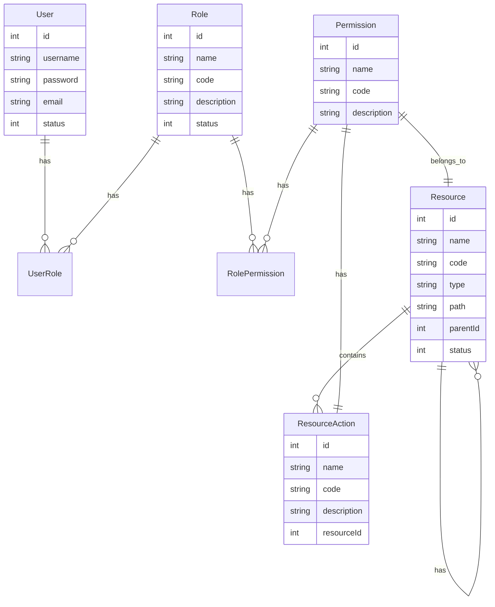
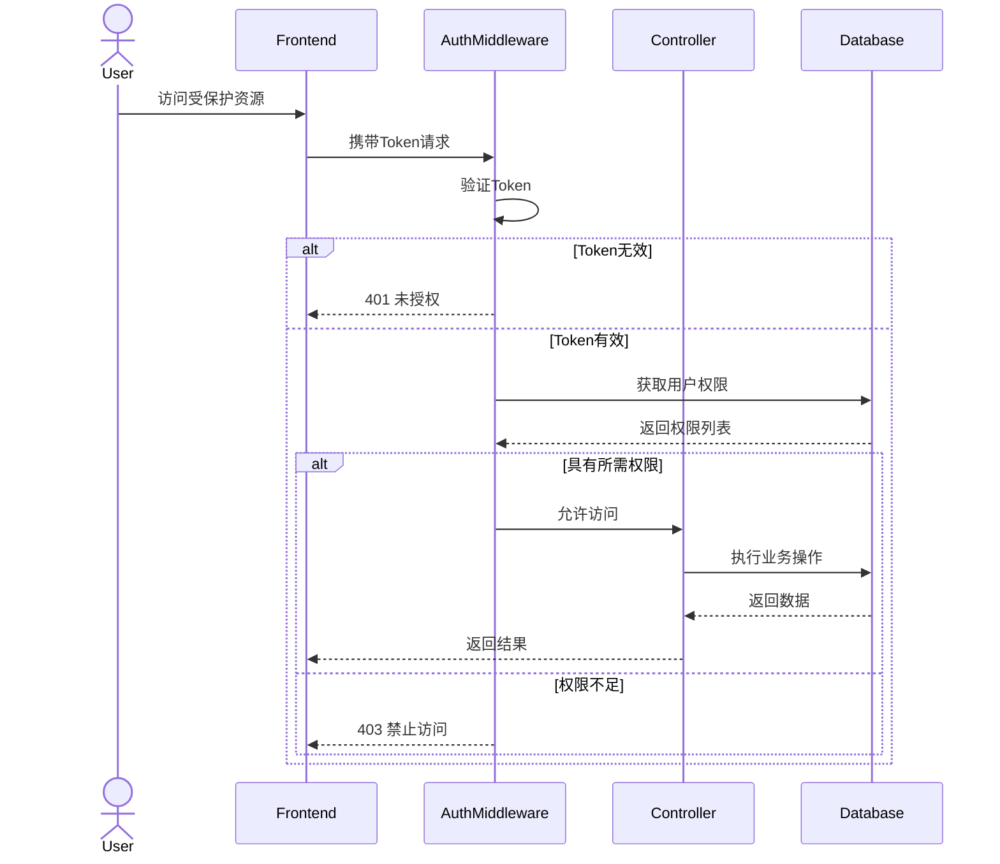
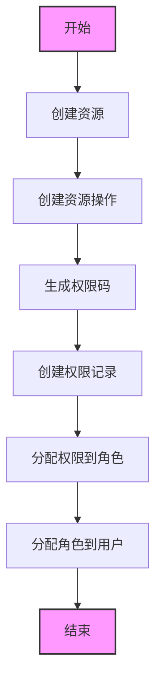

# RBAC 业务流程说明

## 1. 核心模型关系



## 2. 权限控制流程



## 3. 资源分配流程



## 4. 业务操作流程

### 4.1 用户管理

- 创建用户
- 分配角色
- 修改状态
- 重置密码
- 删除用户

### 4.2 角色管理

- 创建角色
- 分配权限
- 修改状态
- 删除角色

### 4.3 资源管理

- 创建资源（菜单/按钮）
- 创建资源操作
- 生成权限码
- 修改状态
- 删除资源

### 4.4 权限验证

1. 前端路由守卫

   - 验证用户登录状态
   - 验证菜单访问权限
   - 控制按钮显示权限

2. 后端接口验证
   - Token 验证
   - 权限码验证
   - 数据权限验证

## 5. 权限码生成规则

```
格式：resource:action
示例：
- system:user:add
- system:user:edit
- system:user:delete
- system:role:list
```

## 6. 关键接口说明

### 6.1 认证接口

- POST /api/auth/login - 用户登录
- POST /api/auth/logout - 用户登出
- POST /api/auth/refresh-token - 刷新令牌

### 6.2 用户接口

- POST /api/users - 创建用户
- GET /api/users - 获取用户列表
- PUT /api/users/:id - 更新用户信息
- POST /api/users/:id/roles - 分配角色
- PUT /api/users/:id/status - 修改用户状态

### 6.3 角色接口

- POST /api/roles - 创建角色
- GET /api/roles - 获取角色列表
- PUT /api/roles/:id - 更新角色信息
- POST /api/roles/:id/permissions - 分配权限
- PUT /api/roles/:id/status - 修改角色状态

### 6.4 资源接口

- GET /api/resources/tree - 获取资源树
- POST /api/resources - 创建资源
- PUT /api/resources/:id - 更新资源
- POST /api/resources/:id/actions - 创建资源操作
- PUT /api/resources/:id/actions/:actionId - 更新资源操作

## 7. 数据结构示例

### 7.1 资源树结构

```json
{
  "id": 1,
  "name": "系统管理",
  "code": "system",
  "type": "menu",
  "path": "/system",
  "children": [
    {
      "id": 2,
      "name": "用户管理",
      "code": "user",
      "type": "menu",
      "path": "/system/users",
      "actions": [
        {
          "id": 1,
          "name": "创建用户",
          "code": "add"
        },
        {
          "id": 2,
          "name": "编辑用户",
          "code": "edit"
        }
      ]
    }
  ]
}
```

### 7.2 用户权限结构

```json
{
  "id": 1,
  "username": "admin",
  "email": "admin@example.com",
  "roles": [
    {
      "id": 1,
      "name": "管理员",
      "code": "admin",
      "permissions": [
        {
          "id": 1,
          "name": "创建用户",
          "code": "system:user:add"
        },
        {
          "id": 2,
          "name": "编辑用户",
          "code": "system:user:edit"
        }
      ]
    }
  ]
}
```
